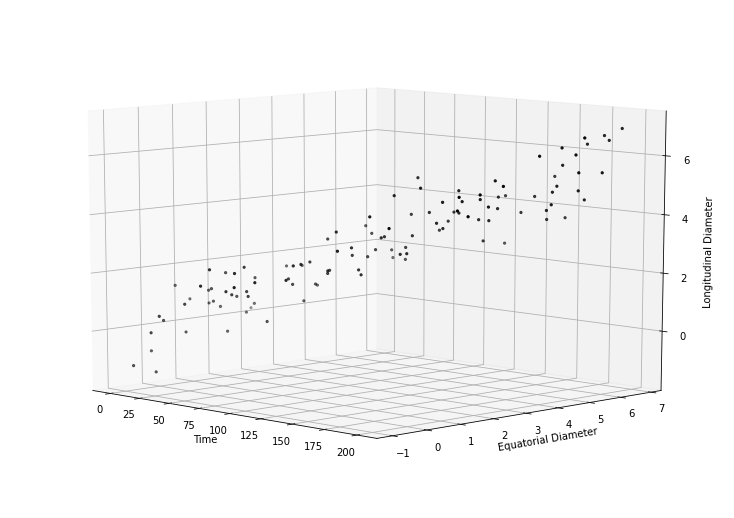
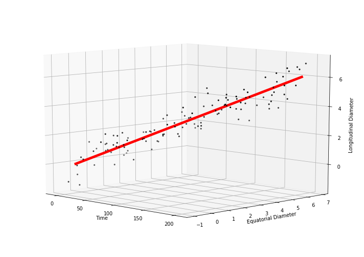

# Fit a line in 3D
**Author:** 
Sergio Esteban Gamboa Muñoz  
Data Analytics and Agricultural Engineer.  
segamboam@gmail.com  
https://www.linkedin.com/in/segamboam/

_______________________________________________________________________________________________________________
## Example of fitting a 3D line for peach fruit data and their respective equations

For this project we will create data that has as a reference the growth and development of peach fruits, for which we have the time (time), the equatorial diameter (dEcua) and the Longitudinal diameter (dLong).

Using singular value decomposition (SVD) we create a 3D line that best fits the point cloud.
For this example we use 2 methods.
1. Calculations were performed using numpy
2. The scikit-spatial library was used

## 3D line equations:

The vector equation for a 3D line can be defined as follows:  
  
For our 3D line of peach fruits it would be:   
  
The parametric equation for a 3D line can be defined as follows:  
   
For our 3D line of peach fruits it would be: 
  
